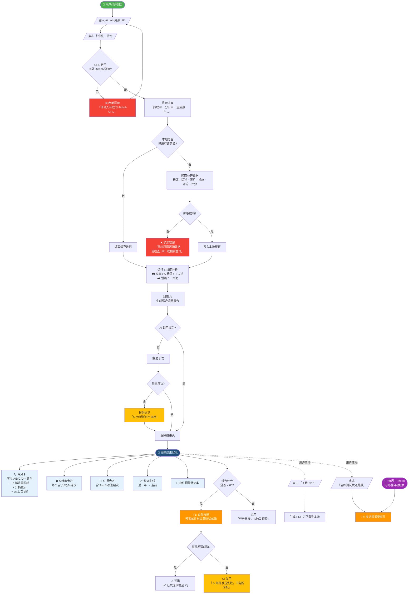

# User Flow — SOZO Review

> 用户主流程：URL 输入 → 抓取 → 5 维度分析 → AI 报告 → 结果页 + 邮件预警
> 关联：[PRD §3](prd.md) · [System Design §6](system-design.md)

GitHub 自动渲染下面的 ```mermaid``` 代码块。需要导出 SVG/PNG 时用 [Mermaid Live Editor](https://mermaid.live/) 粘贴。


